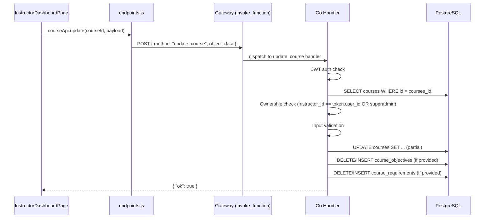
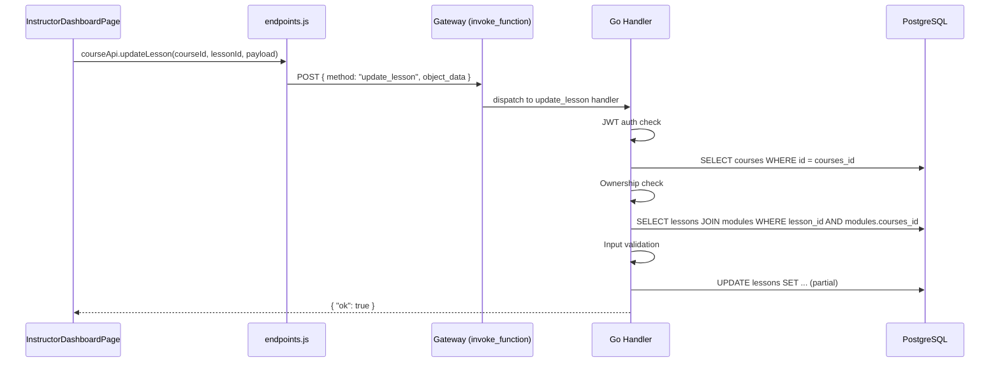
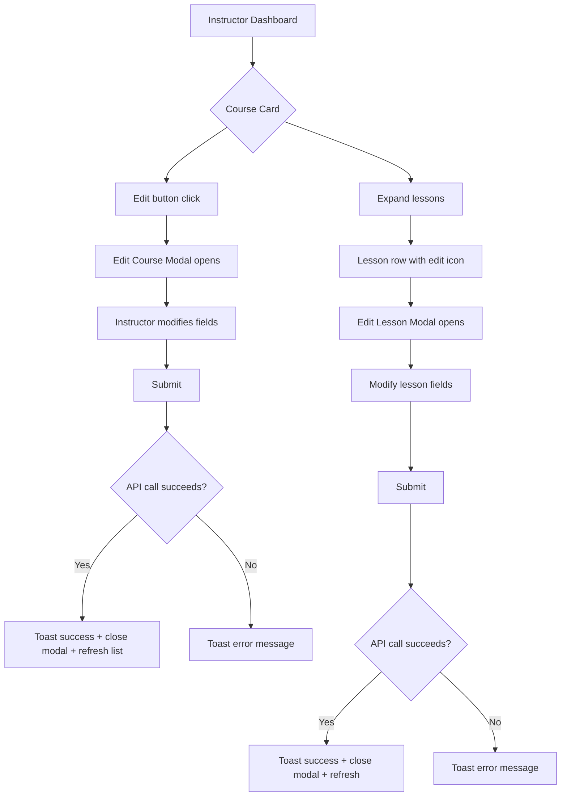

# Design Document: Instructor Edit Course & Lesson

## Overview

This feature adds editing capabilities for instructors to update their existing courses and lessons through the LMS platform. It introduces two new backend methods (`update_course` and `update_lesson`) following the existing `invoke_function` gateway pattern, and adds frontend UI affordances (edit buttons and modal forms) to the Instructor Dashboard.

The design follows the established patterns:
- **Backend**: Go handler methods dispatched via `data.method` in the gateway, with JWT auth, ownership verification, partial updates, and input validation
- **Frontend**: React components using the existing `callGateway` client, Radix Dialog modals, Tailwind styling, and Lucide icons

### Key Design Decisions

1. **Modal-based editing** over page navigation — keeps the instructor in context on the dashboard
2. **Partial updates** — only fields present in `object_data` are modified; absent fields remain unchanged
3. **Ownership-first validation** — auth → existence → ownership → input validation → write (matches existing `create_module`/`create_lesson` pattern)
4. **Replace strategy for arrays** — `what_you_will_learn` and `requirements` use delete-all-then-insert (same as `create_course`)

## Architecture





## Components and Interfaces

### Backend Components

#### 1. `update_course` Handler (Go)

```go
// Method: "update_course"
// Required: JWT auth (instructor or superadmin)
// object_data fields:
type UpdateCourseRequest struct {
    CoursesID       string   `json:"courses_id"`       // required
    Title           *string  `json:"title"`            // optional, max 255 chars
    Description     *string  `json:"description"`      // optional
    CoverImage      *string  `json:"cover_image"`      // optional
    Category        *string  `json:"category"`         // optional
    Difficulty      *string  `json:"difficulty"`       // optional, enum: beginner|intermediate|advanced
    Language        *string  `json:"language"`         // optional
    Price           *float64 `json:"price"`            // optional, >= 0, <= 9999999999.99, max 2 decimals
    DurationHours   *int     `json:"duration_hours"`   // optional
    Status          *string  `json:"status"`           // optional, enum: draft|published
    WhatYouWillLearn []string `json:"what_you_will_learn"` // optional, replace strategy
    Requirements    []string `json:"requirements"`     // optional, replace strategy
}
```

**Processing order:**
1. Authenticate (JWT verification)
2. Validate `courses_id` exists in DB → "Course not found"
3. Ownership check: `courses.instructor_id == token.user_id` OR `token.role == "superadmin"`
4. Check at least one updatable field is present → "No updatable fields provided"
5. Validate each provided field (title length, difficulty enum, price range, status enum)
6. If status → "published": check course has at least one lesson
7. Execute partial UPDATE on `courses` table
8. If `what_you_will_learn` provided: DELETE all from `course_objectives` WHERE `courses_id`, INSERT new items
9. If `requirements` provided: DELETE all from `course_requirements` WHERE `courses_id`, INSERT new items
10. Return `{ "ok": true }`

#### 2. `update_lesson` Handler (Go)

```go
// Method: "update_lesson"
// Required: JWT auth (instructor or superadmin)
// object_data fields:
type UpdateLessonRequest struct {
    CoursesID   string  `json:"courses_id"`   // required
    LessonID    string  `json:"lesson_id"`    // required
    Title       *string `json:"title"`        // optional, max 255 chars
    VideoURL    *string `json:"video_url"`    // optional, non-empty
    DurationMin *int    `json:"duration_min"` // optional, >= 0
    IsPreview   *bool   `json:"is_preview"`   // optional
}
```

**Processing order:**
1. Authenticate (JWT verification)
2. Validate `courses_id` exists → "Course not found"
3. Ownership check
4. Validate `lesson_id` exists within the course (via modules join) → "Lesson not found"
5. Check at least one updatable field is present → "No updatable fields provided"
6. Validate each provided field (title length, video_url non-empty, duration_min >= 0)
7. Execute partial UPDATE on `lessons` table
8. Return `{ "ok": true }`

### Frontend Components

#### 3. API Layer Addition (`endpoints.js`)

```javascript
// Add to courseApi object:
updateLesson: (courseId, lessonId, payload, options) =>
  callGateway("update_lesson", { courses_id: courseId, lesson_id: lessonId, ...payload }, options),
```

#### 4. Edit Course Modal (`EditCourseModal`)

A Radix Dialog modal rendered from the Instructor Dashboard. Pre-populates form fields with current course data. Submits partial updates (only changed fields).

**Props:**
- `open: boolean` — controls visibility
- `onOpenChange: (open: boolean) => void` — close handler
- `course: object` — current course data to pre-populate
- `onSuccess: () => void` — callback to refresh dashboard data

**Fields displayed:**
- Title (text input)
- Description (textarea)
- Category (select)
- Difficulty (select: beginner/intermediate/advanced)
- Language (text input)
- Price (number input)
- Duration hours (number input)
- Status (select: draft/published)
- Cover image URL (text input)
- What you'll learn (textarea, one per line)
- Requirements (textarea, one per line)

#### 5. Edit Lesson Modal (`EditLessonModal`)

A Radix Dialog modal for editing individual lesson details.

**Props:**
- `open: boolean`
- `onOpenChange: (open: boolean) => void`
- `courseId: string` — parent course ID
- `lesson: object` — current lesson data
- `onSuccess: () => void`

**Fields displayed:**
- Title (text input)
- Video URL (text input)
- Duration minutes (number input)
- Is preview (checkbox)

#### 6. Dashboard Course Card Enhancement

Add an "Edit" button (Lucide `Pencil` icon) to each course card in the "My courses" section. Clicking opens the Edit Course Modal.

Add expandable lesson list per course with edit icons on each lesson row.

### UI Flow



## Data Models

### Backend Request/Response

#### `update_course` Request
```json
{
  "data": {
    "method": "update_course",
    "object_data": {
      "courses_id": "uuid",
      "title": "Updated Title",
      "price": 99000,
      "status": "published",
      "what_you_will_learn": ["Item 1", "Item 2"],
      "requirements": ["Req 1"]
    }
  }
}
```

#### `update_course` Response (success)
```json
{ "ok": true }
```

#### `update_lesson` Request
```json
{
  "data": {
    "method": "update_lesson",
    "object_data": {
      "courses_id": "uuid",
      "lesson_id": "uuid",
      "title": "Updated Lesson Title",
      "video_url": "https://youtube.com/watch?v=new",
      "duration_min": 20
    }
  }
}
```

#### `update_lesson` Response (success)
```json
{ "ok": true }
```

#### Error Response Format
```json
{ "status": "error", "data": { "message": "Course not found" } }
```

### Frontend State Model

```typescript
// Edit Course Modal state
interface EditCourseFormState {
  title: string;
  description: string;
  coverImage: string;
  category: string;
  difficulty: "beginner" | "intermediate" | "advanced";
  language: string;
  price: string;          // string for input, converted to number on submit
  durationHours: string;  // string for input
  status: "draft" | "published";
  whatYouWillLearn: string; // newline-separated, split on submit
  requirements: string;    // newline-separated, split on submit
}

// Edit Lesson Modal state
interface EditLessonFormState {
  title: string;
  videoUrl: string;
  durationMin: string;    // string for input
  isPreview: boolean;
}
```

### Database Tables Affected

| Table | Operation | Condition |
|-------|-----------|-----------|
| `courses` | UPDATE (partial) | WHERE `id` = `courses_id` |
| `course_objectives` | DELETE + INSERT | WHERE `courses_id` matches (only if `what_you_will_learn` provided) |
| `course_requirements` | DELETE + INSERT | WHERE `courses_id` matches (only if `requirements` provided) |
| `lessons` | UPDATE (partial) | WHERE `id` = `lesson_id` |


## Correctness Properties

*A property is a characteristic or behavior that should hold true across all valid executions of a system — essentially, a formal statement about what the system should do. Properties serve as the bridge between human-readable specifications and machine-verifiable correctness guarantees.*

### Property 1: Ownership Access Control

*For any* user and any course, the update request SHALL be permitted if and only if the user's `user_id` equals `courses.instructor_id` OR the user's role is "superadmin". All other users (including students and non-owner instructors) SHALL be rejected with a permission error.

**Validates: Requirements 1.1, 1.2, 1.3, 1.4**

### Property 2: Non-existent Course Precedence

*For any* `courses_id` that does not exist in the database and any user (regardless of role), the system SHALL return "Course not found" without performing any ownership or validation checks.

**Validates: Requirements 1.5, 2.8, 4.5**

### Property 3: Course Partial Update Invariant

*For any* valid course and any non-empty subset of updatable fields (`title`, `description`, `cover_image`, `category`, `difficulty`, `language`, `price`, `duration_hours`, `status`), after a successful `update_course` call, only the provided fields SHALL have changed and all other course fields SHALL remain identical to their pre-update values.

**Validates: Requirements 2.1, 2.3**

### Property 4: Array Field Replacement Round-Trip

*For any* valid course and any array of valid strings (0–20 items, each 1–500 characters), updating `what_you_will_learn` or `requirements` SHALL result in the corresponding table containing exactly those items with sequential `order_no` values starting from 0, replacing all previous entries.

**Validates: Requirements 2.4, 2.5, 2.6**

### Property 5: Input Validation Correctness

*For any* field value provided in an update request:
- `title` SHALL be accepted iff its length is ≤ 255 characters
- `difficulty` SHALL be accepted iff its value is one of "beginner", "intermediate", "advanced"
- `price` SHALL be accepted iff it is a non-negative number with at most 2 decimal places and ≤ 9,999,999,999.99
- `duration_min` SHALL be accepted iff it is a non-negative integer
- `status` SHALL be accepted iff its value is one of "draft", "published"
- `video_url` SHALL be accepted iff it is a non-empty string

**Validates: Requirements 2.9, 3.3, 5.1, 5.2, 5.3, 5.4, 5.5, 5.6, 5.8, 4.6**

### Property 6: Status Update Idempotence

*For any* course with a valid status, setting the status to its current value SHALL succeed (return `{ "ok": true }`) without modifying the database record's `updated_at` or any other field.

**Validates: Requirements 3.4**

### Property 7: Lesson Partial Update Invariant

*For any* valid lesson and any non-empty subset of updatable fields (`title`, `video_url`, `duration_min`, `is_preview`), after a successful `update_lesson` call, only the provided fields SHALL have changed and all other lesson fields SHALL remain identical to their pre-update values.

**Validates: Requirements 4.1, 4.2**

### Property 8: Lesson-Course Relationship Enforcement

*For any* `lesson_id` that does not belong to the specified course (i.e., the lesson's module's `courses_id` does not match the provided `courses_id`), the system SHALL return "Lesson not found" regardless of whether the lesson exists in another course.

**Validates: Requirements 4.4**

### Property 9: Validation Precedes Database Writes

*For any* request from a valid owner containing at least one invalid field value, the database state SHALL remain completely unchanged after the request is rejected. No partial writes SHALL occur.

**Validates: Requirements 5.7**

## Error Handling

### Error Response Format

All errors follow the existing gateway pattern:
```json
{ "status": "error", "data": { "message": "<error_message>" } }
```

### Error Priority (Processing Order)

Errors are checked in this order — the first matching condition produces the response:

| Priority | Check | Error Message |
|----------|-------|---------------|
| 1 | Missing/invalid JWT | "Unauthorized" |
| 2 | `courses_id` not found | "Course not found" |
| 3 | Not owner and not superadmin | "You do not have permission to edit this course" |
| 4 | No updatable fields | "No updatable fields provided" |
| 5 | Field validation failure | Field-specific message (see below) |
| 6 | Business rule violation | Rule-specific message |

### Field-Specific Validation Errors

| Field | Condition | Message |
|-------|-----------|---------|
| `title` | > 255 chars | "Title must not exceed 255 characters" |
| `difficulty` | not in enum | "Invalid difficulty value. Allowed values: beginner, intermediate, advanced" |
| `price` | invalid | "Price must be a non-negative number" |
| `duration_min` | invalid | "Duration must be a non-negative number" |
| `status` | not in enum | "Invalid status value. Allowed values: draft, published" |
| `video_url` | empty string | "video_url cannot be empty" |
| `status` | "published" + no lessons | "Cannot publish a course with no lessons" |

### Frontend Error Handling

- API errors are caught and displayed via `toast.error(message)`
- Network failures show a generic "Something went wrong" toast
- Form validation happens client-side before submission (optimistic UX)
- Modal stays open on error so the user can correct and retry

## Testing Strategy

### Property-Based Tests (Backend — Go)

Use a Go PBT library (e.g., `pgregory.net/rapid` or `testing/quick`) to implement the correctness properties above. Each property test runs a minimum of 100 iterations.

**Tag format:** `Feature: instructor-edit-course-lesson, Property {N}: {title}`

Properties to implement:
1. Ownership access control — generate random (user, course) pairs, verify access decision
2. Non-existent course precedence — generate random UUIDs, verify "Course not found"
3. Course partial update invariant — generate random field subsets, verify only those change
4. Array field replacement — generate random string arrays, verify round-trip
5. Input validation correctness — generate random field values, verify accept/reject
6. Status idempotence — generate courses with random statuses, verify no-op on same status
7. Lesson partial update invariant — generate random lesson field subsets
8. Lesson-course relationship — generate cross-course lesson IDs, verify rejection
9. Validation precedes writes — generate invalid payloads, verify DB unchanged

### Unit Tests (Backend — Go)

Example-based tests for specific scenarios:
- Successful course update with all fields
- Successful lesson update with all fields
- "No updatable fields provided" error
- Publishing a course with zero lessons
- Student attempting to update (role rejection)
- Superadmin updating another instructor's course

### Integration Tests

- End-to-end flow: create course → update course → verify changes via `get_course_details`
- End-to-end flow: create lesson → update lesson → verify via `get_lesson_viewer`
- Auth flow: expired token → "Unauthorized"

### Frontend Tests

- Component tests for EditCourseModal and EditLessonModal (render, form interaction, submit)
- Verify `courseApi.update` and `courseApi.updateLesson` call `callGateway` with correct parameters
- Verify error toast appears on API failure
- Verify modal closes and dashboard refreshes on success
