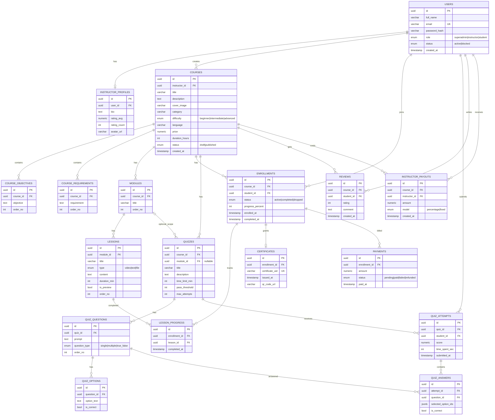

# LMS ERD (Backend uchun)

Quyidagi ERD `lms.md` talablari asosida tuzilgan. React frontend shu struktura bilan ishlashga moslab yozildi.

## Frontend bilan mos endpointlar

- `POST /auth/login`
- `POST /auth/register`
- `POST /auth/refresh`
- `GET /courses`
- `GET /courses/:courseId`
- `POST /courses`
- `PATCH /courses/:courseId`
- `POST /enrollments`
- `GET /enrollments/me`
- `POST /progress/lesson-complete`
- `POST /quizzes/attempts`
- `GET /admin/finance/summary`
- `GET /certificates/verify/:certificateUid`
